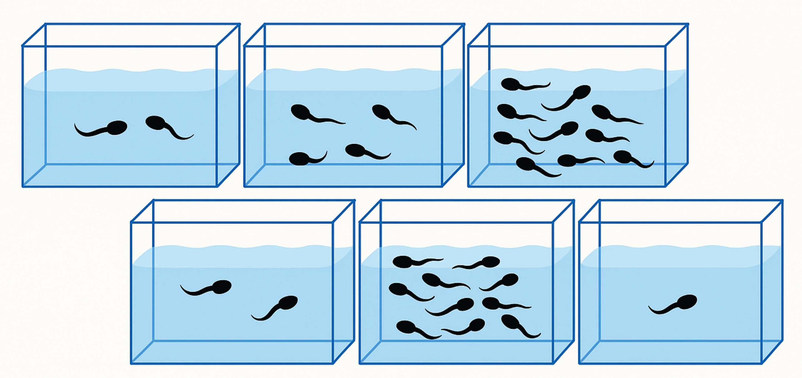
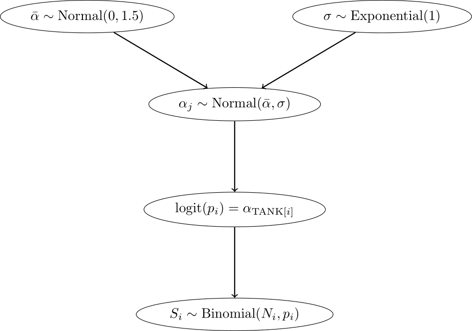

---
output:
  pdf_document: default
  html_document: default
---
# Further Regression Methods

## Linear Mixed Models (LMMs)

In Richard McElreath's book "Statistical Rethinking", 
chapters 13 and 14 deal with multilevel models. 
In Gelman's Book, see " Part 2A: Multilevel Models" and the following.

One very graspable introduction to LMMs is this 
[video](https://www.youtube.com/watch?v=QCqF-2E86r0&ab_channel=MatthewE.Clapham).

We have already come across a [Linear Mixed Model (LMM)](https://en.wikipedia.org/wiki/Mixed_model) 
in the first chapter, where we used the `rethinking` and `lme4` packages to fit a model with 
random intercepts to determine our 
[Intraclass Correlation Coefficients (ICCs)](https://jdegenfellner.github.io/Script_QM3_ZHAW/reliability-and-validity.html#ICC).
They are called *random* intercept since they are drawn from a common normal distribution,
of which the parameters (mean and standard deviation) are estimated from the data.

The **main reason** for using LMMs is that they allow us to model data 
with hierarchical structure, such as repeated measures (of the same subject) 
or nested data (math scores in different schools within different school districts).

- For example, in our Peter and Mary data set where they measured
  ROMs, we had two measurements per subject. The two measurements
  are *clustered* within the subject. 
  They are not independent. If Mary measures a very high $ROM$, changes are that
  Peter as well measures a high value. Hence, the classical linear regression
  model (which assumes the rows/obervations in our data set are independent) 
  is not appropriate and would lead to smaller standard errors.

- Another example is our [*RESOLVE* trial](https://www.zhaw.ch/en/research/project/74535). 
  We are conducting a 
  cluster randomized trial (CRT) with $20$ clusters (physiotherapy offices) 
  and over $200$ patients. Measurements within a cluster
  could be correlated (more similar compared to other clusters).
  One could also think of the physiotherapists performing 
  the treatments as clusters, since - potentially - the outcomes
  for all their patients could be correlated due to a more similiar 
  treatment from the same therapists compared to others. 
  Here the outcome measures are nested within the physiotherapists which
  are nested within the physiotherapy offices 
  (assuming they only work for one office).

### Example: Reed Frog tadpole mortality - two levels {#tadpole}
Let's start with Example 13.1 from McElreath's book (p.401) (Tadpoles in tanks, image by GPT4o).



```{r}
library(rethinking)
library(lme4)
data(reedfrogs)
d <- reedfrogs
str(d)
```

Variables are explained [here](https://www.rdocumentation.org/packages/rethinking/versions/2.13/topics/reedfrogs) 
(see also p.401 in the book).
The original paper can be found [here](https://link.springer.com/article/10.1007/s00442-004-1806-x).

The number of surviving [tadpoles](https://en.wikipedia.org/wiki/Tadpole) *surv* should be modeled.
Now, each row is a different "tank" ($48$ in total), an experimental environment that contains tadpoles.
Obviously, the tanks are one option for *clustering* the data, assuming the tadpoles within the same
tank live in a more similar environment than those in different tanks (or get a more similiar "treatment").
We could rewrite the data set to have one row per individual tadpole 
(instead of number of survived a binary variable) and the cluster variable 
called *tank* ([exercise 1](#exercise1_LMM)). We would then model the survival probability
of tadpoles ($1$ could mean *survived* and $0$ could mean *died*). Formally, 
this would be a so-called [logistic regression](https://en.wikipedia.org/wiki/Logistic_regression) (see below), 
since our outcome is binary (*survided*/*died*).

When estimating the number of surviving tadpoles we could consider the following options:

- **Complete pooling** ([exercise 6](#exercise6_LMM)): Estimate the overall survival probability 
  (ignoring the tank effect). 
  In this case, one might miss between-variance from the different tanks. 
  A single intercept is used for all tanks.
- **No pooling**: Estimate the survival probability for each tank (ignoring the overall effect completely). 
  Here, the tanks do not "know" anything from one another. Information of one tank is not used for the other tanks.
  An intercept is estimated for each tank ($48$ in total). 
  This approach would be equivalent to using indicator variables for each tank.
- **Partial pooling**: Estimate the survival probability for each tank, 
  but use information from the other tanks.

#### Model 13.1. No pooling using regularizing priors {#model13_1}

Let's start with the second model (intercept for each tank) with a regularizing prior. 
We want to model the
number of surviving tadpoles in the tanks by using a binomial distribution with 
different survival probabilities for each tank.

Here is our model in the typical notation:

\[
\begin{array}{rcl}
S_i &\sim& Binomial(N_i, p_i) \\
logit(p) &=& \alpha_{TANK}[i] \\
\alpha_j &\sim& \text{Normal}(0, 1.5)~\text{for } j=1,\ldots,48
\end{array}
\]

This is a **varying intercept model** (the simplest kind of **varying effects** model) 
with $48$ intercepts (one for each tank).

The number of surviving tadpoles $S_i$ in tank $i$ is modeled as a binomial distribution with
$N_i$ trials (the number of tadpoles in the tank) and $p_i$ the survival probability of tank $i$.
The **regularizing priors** for $\alpha_j$ is a normal distribution with mean $0$ and standard deviation $1.5$.

Technically, **we could use different priors for each intercept**, 
but this would be a bit cumbersome and we do not have useful prior information
about the survival probabilities of the tanks.

Notice that we use a `logit` link function to transform the probability $p$ (range $(0,1)$) 
to the range $(-\infty, \infty)$.
This way, we can use a normal distribution for the prior of the intercepts.
The inverse of the logit function is also available in `rethinking`: `inv_logit`.
`rethinking::inv_logit(0)`gives the probability of $0.5$. So, we assume a coin flip for 
the survival probability of the tadpoles in the tanks *a priori* 
(maybe not the worst starting point if you have no clue).

What survaival probabilities do we assume a priori? Well, according to 
the normal distribution with a standard deviation of $1.5$ we assume that the
95% of the logit-transformed survival probabilities are between $-3$ and $3$.
This means that the survival probabilities in the tanks are in:
```{r}
c(rethinking::inv_logit(-3), rethinking::inv_logit(3))
```
This assumption seems rather reasonable and survival probabilities are not constrained very much.

Next we define the data set for the model and use the `ulam` function 
from the `rethinking` package to fit the model.

```{r}
library(rethinking)

d$tank <- 1:nrow(d)
dat <- list(S = d$surv,
            N = d$density,
            tank = d$tank)

# approximate posterior
set.seed(122)
m13.1 <- ulam(
  alist(
    S ~ dbinom(N, p),
    logit(p) <- a[tank],
    a[tank] ~ dnorm(0, 1.5)
  ) , data = dat, 
  chains = 4, 
  log_lik = TRUE,
  cores = detectCores() - 1)
precis(m13.1, depth = 2)

# expected survival in tank 1
rethinking::logistic(1.717154006) # same as inv_logit(1.717154006)
```

The R-output from `precis(m13.1, depth = 2)`shows the posterior means and standard deviations of
our $48$ intercepts ($48$ tanks with tadpoles). These intercepts are on the scale $(-\infty, \infty)$.

Note that you can always switch from the range $(-\infty, \infty)$ to a probability using the `logistic` function
from the `rethinking` package - these functions are called *squashing functions* for a reason. 
The `inv_logit`function does the same.

\[
\mathrm{logistic}(x) = \mathrm{inv\_logit}(x) = \frac{1}{1 + e^{-x}}
\]

The other way around works as well, using the `logit` function.
$$\text{logit}(p) = \log\left( \frac{p}{1 - p} \right)$$

Let's quickly see if these are indeed inverse functions of each other -> [exercise 5](#exercise5_LMM).

#### Model 13.2: Partial pooling using adaptive pooling {#model13_2}

**Next**, we use **adaptive pooling**. For this, we use priors for the `a[tank]` parameters,
but know they *know* from each other via the prior for $\bar{\alpha}$.
This model learns from the data how much the intercepts should be pulled towards a common mean.
Now we have an additional level in the model hierarchy:

- In the **top level**, the outcome is $S$, the parameters are the intercepts 
  $\alpha_{TANK[i]}$, 
  and the priors are $\alpha_j \sim N(\bar{\alpha}, \sigma)$.
- In the **second level**, the "outcome" are the intercepts $\alpha_{TANK[i]}$, 
  the parameters are $\bar{\alpha}$ and $\sigma$,
  and the priors are $\bar{\alpha} \sim N(0, 1.5)$ and 
  $\sigma \sim \text{Exponential}(1)$.

\[
\begin{array}{rcl}
S_i &\sim& \text{Binomial}(N_i, p_i) \\
\text{logit}(p) &=& \alpha_{\text{TANK}[i]} \\
\alpha_j &\sim& \text{Normal}(\bar{\alpha}, \sigma)\\
\bar{\alpha} &\sim& \text{Normal}(0, 1.5)\\
\sigma &\sim& \text{Exponential}(1)
\end{array}
\]

Since the parameters in the prior of the $\alpha_j$ have also priors 
(last two lines are new), we have a *multilevel* model.
In this case, we have *two* levels and the parameters 
$\bar{\alpha}$ and $\sigma$ are called **hyperparameters**.
The priors of the hyperparameters are called **hyperpriors**.
The **amount or regularization is controlled by the hyperparameter** $\sigma$ and is 
learned from the data. $\sigma$ controls, how much the intercepts are
allowed to deviate from the mean $\bar{\alpha}$. The smaller $\sigma$,
the more the intercepts are pulled towards the mean $\bar{\alpha}$.

Below, we see the model hierarchy:



We now fit the model using the `ulam` function from the `rethinking` package.

```{r}
library(conflicted)
conflicts_prefer(posterior::var)
conflicts_prefer(posterior::sd)
m13.2 <- ulam(
  alist(
    S ~ dbinom(N, p),
    logit(p) <- a[tank],
    a[tank] ~ dnorm(a_bar, sigma),
    a_bar ~ dnorm(0, 1.5),
    sigma ~ dexp(1)
  ) , data = dat, 
  chains = 4, 
  log_lik = TRUE,
  cores = detectCores() - 1)
precis(m13.2, depth = 2)
```
Now, the output of `precis(m13.2, depth = 2)` additionally shows the posterior means 
and standard deviations of the hyperparameters $\bar{\alpha}$ (`a_bar`) 
and $\sigma$ (`sigma`).


#### Conceptual difference between model 13.1 and 13.2

**Model 13.1** is not a multilevel model, we just tell the model there are 
$48$ tanks and each tank has its own intercept. For each intercept, we use
the same prior distribution ($Normal (0, 1.5)$), but we could use different ones if 
we had knowledge about the survival probabilities of some of the tanks. 
Note that the priors themselves are not connected via another level.
They do their thing independently.

 - By *decreasing* the variance of these priors, 
   we are dampening the influence of the data on the intercepts
   which are drawn towards to overall mean. 

- *Increasing* the variance of the priors
  to a value large enough will result in the raw survival probabilities for each tank.
  This would be the same as if we took indicator variables for each tank. 
  See [exercise 2](#exercise2_LMM).

**Model 13.2** is a **multilevel model**. Now the model *learns from the data* 
from which overall
mean and variance the intercepts are drawn ($Normal(\bar{\alpha}, \sigma)$).
The prior for $\bar{\alpha}$ expresses our belief about the mean survival probability,
while the prior for $\sigma$ expresses our belief about the variability of the survival probabilities.

**Figure 13.1 from the book** depicts the pooling effect of model 13.2. with respect to
tadpole tank size.

```{r, echo=FALSE}
# Extract Stan samples
post <- extract.samples(m13.2)

# Compute mean intercept for each tank and transform to probability
d$propsurv.est <- rethinking::logistic(apply(post$a, 2, mean))

# Display raw proportions surviving in each tank
plot(d$propsurv, ylim = c(0, 1), pch = 16, xlab = "tank", ylab = "proportion survival",
     xaxt = "n", col = rangi2)
axis(1, at = c(1, 16, 32, 48), labels = c(1, 16, 32, 48))

# Overlay posterior means
points(d$propsurv.est)

# Mark posterior mean probability across tanks
abline(h = mean(inv_logit(post$a_bar)), lty = 2)

# Draw vertical dividers between tank densities
abline(v = 16.5, lwd = 0.5)
abline(v = 32.5, lwd = 0.5)
text(8, 0, "small tanks")
text(16 + 8, 0, "medium tanks")
text(32 + 8, 0, "large tanks")
```

In [exercise 2](#exercise2_LMM) we make the difference between the models 13.1 and 2 clearer.
Figure 13.1 from the book shows the posterior survival probabilities for each tank from 
model 13.2 (black circles) and raw survival probabilities (blue filled points).
What we can see is that the estimated survival probabilities for the hierarchical model
are drawn towards the mean overall survival probability across all tanks 
(dashed line; $logistic(\bar{\alpha}) \approx 0.79$).

- In large tanks, there is less shrinkage (enough information/observations), while in small tanks the estimates are 
  pulled more towards the mean (information is used from other tanks).
- The more extreme the raw survival probability (with respect to the overall survival probability), 
  the more it is pulled towards the mean.

This is the **pooling** effect of the model. The phenomenon is called **shrinkage**.

See also [exercise 3](#exercise3_LMM) to improve your understanding of two models.

#### Compare models 13.1 and 13.2 with respect to predictive ability on unseen data

In [QM2](https://jdegenfellner.github.io/Script_QM2_ZHAW/intro.html#explanatory-vs.-predictive-models) 
we talked about the difference between 
[explanatory vs. predictive models](https://projecteuclid.org/journals/statistical-science/volume-25/issue-3/To-Explain-or-to-Predict/10.1214/10-STS330.full).
If you are interested, you can read section 7.4 (p.217) in the book.

In a **prediction context** we ask ourselves: 
How well do the models *predict* the data 
(which was measured using residuals $y_i - \hat{y}_i$ on the 
*training set* in regression)?

There are many nuances but the **main paradigm** (also in classical machine learning) is to
*fit* the model on a **training set** and *evaluate* the model on a **test set**.
Should you be interested in the (admittedly very technical) details,
I can recommend the book *Elements of Statistical Learning* by Hastie, 
Tibshirani and Friedman (free [here](https://www.sas.upenn.edu/~fdiebold/NoHesitations/BookAdvanced.pdf)).

During **training**, the model tries to learn the underlying structure of the data.

If the model is too complex, the model can [*overfit*](https://miro.medium.com/v2/resize:fit:1400/format:webp/1*_7OPgojau8hkiPUiHoGK_w.png), 
which means that the model learns too much of the noise in the data instead of the underlying structure.

If the model is too simple, the model can *underfit* the training data,
which means that the model learns the underlying structure of the data too vaguely.

The test set is used to evaluate the model's performance on unseen data.
This is the ultimate and brutally honest test of the model's predictive ability.

For instance, if you think back to our [body height prediction example in QM2](https://jdegenfellner.github.io/Script_QM2_ZHAW/multiple-linear-regression.html#adding_transformed_predictor_bayes),
we could fit the model on 80% of people (training set) and see how precise the model is on 
the remaining 20% of people (test set). Let's do this in [exercise 7](#exercise7_LMM).

Remember, in prediction we do not care about interpretability of the model.
We could have a blackbox model (e.g. neural networks) and still be happy with it.
This performance can often be surprisingly good (like in the case of [hand digit 
recognition](https://en.wikipedia.org/wiki/MNIST_database#Classifiers) reaching error rates as low as 0.09%), 
or surprisingly bad (when trying to predict some binary outcome using logistic regression in applied health 
research where the performance is often not far away from the base rate probability).

In order to estimate the predictive ability (on an unseen test set) of a model, 
there are many criteria available. One of them is the **WAIC**:

```{r}
WAIC(m13.1)
WAIC(m13.2)
compare(m13.1, m13.2, func = WAIC) # change func to other criteria if needed.
```

**WAIC** stands for *Widely Applicable Information Criterion* and is a 
measure of prediction accuracy on new data (out of sample deviance); see 
p.219 and p.404 in Statistical Rethinking. As it is pointed out in the book "Using tools like
[PSIS](https://sites.stat.columbia.edu/gelman/research/unpublished/VehtariGelmanGabry_PSIS_2017.pdf) 
and [WAIC](https://en.wikipedia.org/wiki/Watanabe%E2%80%93Akaike_information_criterion) 
is much easier than understanding them."

We do not go into the details of WAIC, but as a **first dirty rule of thumb**,
the model with the lower WAIC is preferred. One should never solely rely on
this criterion, especially not if one is interested in causal questions.

What are the columns?

- `WAIC`: guess of the out-of-sample deviance.
- `SE`: standard error of the WAIC estimate. This is a measure of uncertainty of the WAIC.
- `dWAIC`: difference of each WAIC from the best model (with the *smallest* WAIC).
- `dSE`: standard error of this difference. Here, the standard error of the 
   difference ($3.79$) is much smaller compared to the difference in WAIC 
   between the models ($15.88993$). **Hence, one can distinguish between the models using WAIC.
   $\rightarrow$ m13.2 is preferred** (with respect to predictive ability on unseen data).
- `pWAIC`: prediction penalty. This is close to the number of parameters in the posterior.
- `weight`: the Akaike weight, a measure of relative support for each model. In our case,
  it is almost 1 for model 13.2 and almost 0 for model 13.1.

Feel free to read p.227 in the book, specifically before you use WAIC
in a publication or thesis.

One can also plot this information for a better overview:

```{r}
plot(compare(m13.1, m13.2, func = WAIC))
```

The filled points show how the model performs on the data it was trained on.
Typically, this is lower compared to the out-of-sample deviance (open points)
for both models.
Section 13.2 (especially Figure 13.3.) in the book shows that partial pooling also yields (on average) better
predictions compared to no pooling, it's a tradeoff between over- and underfitting.

##### Frequentist version model 13.2 {#frequentist13_2}

In the Frequentist setting we can use the `lme4` package to fit the analog 
to model 13.2. To be more specific, 
we use a [generalized linear mixed model (GLMM)](https://en.wikipedia.org/wiki/Generalized_linear_mixed_model).
*Generalized* because we assume a binomial distribution for the response variable,
while usually we have a continuous outcome variable (like body height in cm).

Let's fit the model and explain the outcome first. $S$ is the number of surviving tadpoles, 
$N$ is the number of tadpoles in the tank.

```{r}
library(lme4)

m_lmer <- glmer(
  cbind(S, N - S) ~ (1 | tank),
  data = dat,
  family = binomial(link = "logit"),
  control = glmerControl(optimizer = "bobyqa")
)
summary(m_lmer)
```

For convergence reasons (after trial and error), we used the `bobyqa` optimizer.
We do not care so much about the technical details behind the model fitting procedure.
Briefly, the model is not fitted using the least squares method anymore,
but the [maximum likelihood method](https://www.youtube.com/watch?v=XepXtl9YKwc&ab_channel=StatQuestwithJoshStarmer) 
(see also Westfall p.43-52), 
which is another way of finding model parameters in parametric statistics.
Interestingly, the way to fit the model in front of us is outlined in the help file of the command 
`glmer` (see `?glmer`).

The syntax `(1 | tank)` means that we fit a random intercept for each tank.
For details on the random effect structure definition see 
[p.7 here](https://cran.r-project.org/web/packages/lme4/vignettes/lmer.pdf).
You will always see such a term if you model clustered data in the Frequentist 
setting (at least in R).

[AIC (Akaike Information Criterion)](https://en.wikipedia.org/wiki/Akaike_information_criterion) 
and [BIC (Bayesian Information Criterion)](https://en.wikipedia.org/wiki/Bayesian_information_criterion) 
are two measures of model fit which both consider the model fit and the number 
of parameters simultaneously. Both punish the number of parameters in the model, 
but not equally strong.

In the summary output, we see the values for AIC, BIC and the log-likelihood.
The latter is used to fit the model. `-2logLik` is the so-called *deviance* of 
the model and has - under $H_0$ - a $\chi^2$ distribution that can be exploited 
for hypothesis testing. This term takes the place of the residual sum of squares
in least squares regression.

The `Std.Dev.` of the `Random effect` `tank` is $1.568$ which should be somewhat similar 
to the `sigma` in the Bayesian model ($1.614989185$), which is the case here.
The major difference is that in the Frequentist model, this $\sigma$ is only 
learned from the data, while in the Bayesian model we have priors too.

The `Fixed effect` `(Intercept)` ($1.3786$) is the `logit` of the mean survival probability 
across all tanks and analog to the `a_bar` ($1.3420237045$) in the Bayesian model. 

`df.resid`is $46$, sample size is $48$. Two degrees of freedom are lost due 
to the estimation of the overall `(Intercept)` and the random effect (the standard 
deviation $\sigma$ of `tank`).

And of course, at the bottom of the summary output, for the *stargazers* among us, are the `Signif. codes`.

In summary, both (Frequentist and Bayesian) models deliver rather similar results.

We leave it as an [exercise](#exercise4_LMM) (4) to compare the model-estimated survival probabilities
in the tanks for both models.

Section 13.2. in the book shows that partial pooling also yields (on average) better 
predictions compared to no pooling, it's a tradeoff between over- and underfitting 
(i.e. the raw probabilities in each tank without knowledge of the other tanks and one 
overall survival probability that ignores differences between tanks completely).

### Example: Mulligan manual therapy - paper {#mulligan}

We want to replicate the main result of 
["Mulligan manual therapy added to exercise improves headache frequency,
intensity and disability more than exercise alone in people with cervicogenic
headache: a randomised trial"](https://doi.org/10.1016/j.jphys.2024.06.002).

This randomized clinical trial evaluated the effectiveness of adding Mulligan manual therapy 
to exercise in patients with cervicogenic headache. The study found that combining 
Mulligan therapy with exercise led to greater improvements in headache frequency, 
intensity, and disability compared to exercise alone or a control group.

Some comments:

- They used SPSS for data analysis. Unfortunately,
  no code was provided or another convenient way replicate the
  results.

- Data *was* provided as Excel file in the 
  [appendix](https://www.sciencedirect.com/science/article/pii/S1836955324000572?via%3Dihub#appsec1).

- At first glance, I could not find a method for sample size calculation
  in the referenced [literature](https://journals.sagepub.com/doi/epub/10.1177/0333102417738202).
  Let's research this more as an [exercise](#exercise8_LMM).

- The primary outcome is *headache frequency*
  (headache days per month). Ad hoc, such a count variable is not very likely 
  to be normally distributed. In the methods section they state "For outcomes with
  normally distributed data, means and standard deviations were calculated".
  Table 2 in the paper implies that the primary outcome should be normally distributed.
  Verify this as [exercise](#exercise9_LMM) using the `shapiro.test` function in R.
  We (only) do this, since they as well used a version of this test.
  The primary outcome variable has only $6$ unique values ($4-9$) at week $0$
  and can therefore (strictly speaking) not be normally distributed 
  (normal distribution takes infinitely many values).

- I am not sure what the authors mean exactly with the term "general linear model". 
  [Here](https://books.google.at/books?hl=en&lr=&id=G_qdEsDlkp0C&oi=fnd&pg=PA101&dq=%22general+linear+model%22&ots=Xo0OAwX2UL&sig=TRvLmI4G9oti296S5wjmiWjfWVY&redir_esc=y#v=onepage&q=%22general%20linear%20model%22&f=false)
  (p.102) a general linear model is just a multiple linear regression model.
  My guess is that they did a two-way repeated measures ANOVA.

- There seems to be no checking of the 
  [model assumptions](https://statistics.laerd.com/spss-tutorials/two-way-repeated-measures-anova-using-spss-statistics.php) 
  in the paper. 

- There seems to be no description of handling missing data.

#### Frequentist attempt to replicate the results.

We could try to use [this](https://www.r-bloggers.com/2021/04/repeated-measures-of-anova-in-r-complete-tutorial/) 
as guideline if we wanted to replicate the two-way repeated measures ANOVA.

Maybe we try to use the `lme4` package first to fit a linear mixed model (LMM), which 
is the more modern approach.

The model equation should be:

\[
\begin{array}{rcl}
\text{headache frequency}_{ij} &\sim& \text{Normal}(\mu_{ij}, \sigma) \\
\mu_{ij} &=& \alpha + \beta_1 \text{group}_i + \beta_2 \text{time}_j + \beta_3 (\text{group}_i \times \text{time}_j) + u_i + \varepsilon_{ij}
\end{array}
\]

- We model the headache frequency of patient $i$ at time point $j$ as normally distributed.
  It remains to bee seen if a normally distributed headache frequency is a good assumption.
  We will check this later. A priori, I would be doubtful.
- $\alpha$ is the overall intercept (mean headache frequency at week $0$ for the reference group)
- $i = 1, \ldots, 99$ are the $99$ participants (respectively 91 with complete observations)
- $j$ is the time point (week $0$, $4$, $13$, $26$)
- $u_i$ is the random effect for participant $i$ (intercept), which comes from a normal distribution of course
- $\varepsilon_{ij}$ is the residual error term, which is also normally distributed. 
  This is a measure of how much the model does not explain.
- The interaction term allows for different intercepts for all combinations of group and time.
  Note that both `group` and `time` are factors in the model. There are $12$ combinations of group and time
  (3 groups times 4 time points).
  Be careful with the interpretation of the interaction term. As soon as an interaction term
  is present, we cannot directly interpret the main effects anymore.

Let's first bring our data in shape (long format for `lmer`) and 
(for simplicity) kill all rows with missing values ($8$ observations).
Ideally, we would need to argue how we handle missing data!

```{r}
library(readxl)
library(tidyverse)

url <- "https://raw.githubusercontent.com/jdegenfellner/Script_QM3_ZHAW/main/data/Chapter_Further_Regression/Paper_Mulligan%20manual%20therapy%20added%20to%20exercise/1-s2.0-S1836955324000572-mmc1.xls"
temp_file <- tempfile(fileext = ".xls")
download.file(url, destfile = temp_file, mode = "wb")
df <- suppressMessages(
  suppressWarnings(
    readxl::read_xls(temp_file, sheet = 2)
  )
)

df <- df[3:dim(df)[1], 1:6]
head(df)
dim(df)
colnames(df) <- c("ID", "Group", "Week_0", 
                "Week_4", "Week_13", "Week_26")
df

# Omit missing values since they will be thrown out anyways when using lmer!
df <- na.omit(df) # 8 rows (patients) are out!

df_long <- df %>%
  pivot_longer(
    cols = starts_with("Week_"),
    names_to = "time",
    values_to = "headache_frequency"
  ) %>%
  mutate(
    headache_frequency = as.numeric(headache_frequency),
    time = dplyr::recode(time,
                  "Week_0" = 0,
                  "Week_4" = 4,
                  "Week_13" = 13,
                  "Week_26" = 26)
  )

df_long$ID <- as.factor(df_long$ID)
df_long$time_f <- factor(df_long$time, levels = c(0, 4, 13, 26))
df_long
```

This seems to be okay. Note that we have 364 lines because of the long format:
$91$ participants (with complete observations) times $4$ time points 
($0, 4,13,26$ weeks).

Next, we look at the raw data with a spaghetti plot. 
**It is alway a good idea to know your raw data.**
Below, we have plotted the headache frequency colored by group. 
Time (week) is an integer variable and therefore the distances between 
the time points are not equal.

```{r}
ggplot(df_long, aes(x = time, y = headache_frequency, group = ID, color = Group)) +
  geom_line(alpha = 0.6, linewidth = 1) +
  geom_point(size = 2) +
  scale_x_continuous(breaks = c(0, 4, 13, 26)) +
  labs(
    title = "Spaghetti Plot: Headache Frequency Over Time",
    x = "Week",
    y = "Headache Frequency",
    color = "Group"
  ) +
  theme_minimal() +
  theme(
    plot.title = element_text(size = 14, face = "bold"),
    legend.position = "top"
  ) + 
  theme(plot.title = element_text(hjust = 0.5))
```

It seems that the 3 different groups have different slopes which is indicative 
of an interaction effect between group and time. This means,
treatments may differ in their effectiveness.
*MMT + ex* seems to be clearly better compared to the other two groups 
(*Ex* and *Sham + ex*). Since participants were randomly assigned to the groups,
this is indicative of a treatment effect.

With respect to our **clustering**, in our long data set,
we have repeated measures for each participant (ID) at different time points.
There are no repeated treatments though, since each participant
is only in one group (of the three) and they do not crossover to 
one of the other treatments during the trial.
*Why do we not need a random intercept for the group?*
We are not drawing the groups from a larger population, 
the groups are fixed and the only ones of interest. 
The participants on the other hand are 
drawn from a larger population.
Hence, we only consider the random intercept for each participant.

Let's fit the model using the `lme4` package:
```{r}
library(lme4)
library(emmeans)
model <- lmer(headache_frequency ~ Group * time_f + (1 | ID),
              data = df_long)
summary(model) # ref for time: week 0
```

We are estimating headache frequency while considering repeated measures within patients.

In the random effects part of the output, we see again the standard 
deviation of the random intercept for each patient ($0.5872$),
which is a measure of the variability of headache frequency between patients.
Residual variance ($0.6619$) is high compared to this.

The so-called `Fixed effects` give the overall intercept in all
our factor combinations: `(Intercept)` is the overall mean headache frequency at week $0$ (reference week)
and Group `Ex` (reference group).

Important for us are the so-called **contrasts** (below). 
These give us the **model-estimated differences** in (expected) headache frequency between 
the groups at each time point. To be exact, we are actually interested in 
the **difference in differences** (DiD) (see Table 3 in the paper):
\[
\text{headache frequency}_{\text{MMT+ex}} - \text{headache frequency}_{\text{Sham+ex}} \text{ at week } 4 \\
\textbf{minus} \\ 
\text{headache frequency}_{\text{MMT+ex}} - \text{headache frequency}_{\text{Sham+ex}} \text{ at week } 0
\]

```{r}
library(emmeans)
emm <- emmeans(model, ~ Group * time_f)
emm_df <- as.data.frame(emm)
emm_df

contrast_vec <- list(
  "MMTvsSham_W4_minus_W0" = c(
    0,   # Ex @ 0
    +1,  # MMT+ex @ 0
    -1,  # Sham+ex @ 0
    0,   # Ex @ 4
    -1,  # MMT+ex @ 4
    +1,  # Sham+ex @ 4
    0, 0, 0, 0, 0, 0 # ignore reset (13 & 26)
  )
)

contrast(emm, method = contrast_vec, infer = c(TRUE, FALSE))


```

[Bonferroni correction](https://en.wikipedia.org/wiki/Bonferroni_correction) 
is used to adjust the $p$-values for multiple comparisons
(one just divides the "significance"-level by the number of comparisons).

We now look at Table 3 in the paper, first row, first column.
There we see the mean between-group difference in headache frequency
at week $4$ compared to week $0$ and the two groups *MMT + ex* and *MMT Sham + ex*
are compared. 

- The mean difference (in the paper) is $-3$ (95% CI: $-3$ to $-2$) days/month. 
- In our `contrast` output, we find the row
  `MMTvsSham_W4_minus_W0     2.68 0.295 264      2.1     3.26`.
  
After rounding to integers we get the same results.

If you want to see the **random effects** of all $91$ participants explicitely:

```{r}
ranef(model)  # random effects
re <- ranef(model)
str(re$ID) # 91 obs, 91 participants
```

**Posterior Predictive checks** and **residuals** look surprisingly good:

```{r}
library(car)
library(performance)
qqPlot(residuals(model))
check_model(model, check = "pp_check")
```

The density estimators might be a bit misleading since we only have a rather small
number of different levels and of course a count variable can not be negative. 

#### Bayesian attempt to replicate the results {#mulligan_bayesian}

We can also try to fit the model using the `rethinking` package.

Model equations and priors:

\[
\begin{array}{rcl}
\text{headache frequency}_{ij} &\sim& \text{Normal}(\mu_{ij}, \sigma) \\
\mu_{ij} &=& \alpha + \beta_1 \text{group}_i + \beta_2 \text{time}_j + 
              \beta_3 (\text{group}_i \times \text{time}_j) + u_i\\
\alpha &\sim& \text{Normal}(5, 1.5) \\
\beta_1[group] &\sim& \text{Normal}(0, 1.5) \\
\beta_2[time] &\sim& \text{Normal}(0, 1.5) \\
\beta_3[group*time] &\sim& \text{Normal}(0, 1.5) \\ 
u_i &\sim& \text{Normal}(0, \sigma_u) \\
\sigma_u &\sim& \text{Exponential}(1) \\
\sigma &\sim& \text{Exponential}(1) \\
\end{array}
\]

The priors for $\beta_3$ is hard since there is no natural meaning to it.
Note that we could also combine $\alpha$ and the $u_i$ as we did before in the 
partial pooling case for reliability. This should deliver similar results 
([exercise 10](#exercise10_LMM)).
With this model we now fit intercepts for every group ($3$), 
every time point ($4$) and for all $3*4=12$ interaction combinations.
Since we are not working with a reference level for the factors (as in `lmer`), you see
all $3,4$ and $12$ (mean posterior) levels of the intercepts in the output of `precis(m)`. 
Refer to section 5.3 (Categorical variables) in the book *Rethinking* for more details.

```{r}
library(rethinking)

df_long <- df_long %>%
  dplyr::group_by(Group, time) %>%
  dplyr::mutate(interaction = cur_group_id()) %>%
  dplyr::ungroup()
# cur_group_id() gives a unique numeric identifier for the current group.

dat <- list(
  H = df_long$headache_frequency,
  group = as.integer(as.factor(df_long$Group)),   # 1 = Ex, 2 = MMT+ex, 3 = Sham+ex
  time = as.integer(df_long$time_f),              # 1 = Woche 0, ..., 4 = Woche 26
  ID = as.integer(as.factor(df_long$ID)),
  N = nrow(df_long),
  N_ID = length(unique(df_long$ID)),
  N_group = length(unique(df_long$Group)),
  N_time = length(unique(df_long$time_f)),
  interaction = df_long$interaction
)

m <- ulam(
  alist(
    H ~ normal(mu, sigma),
    mu <- alpha +
      beta_group[group] + beta_time[time] + beta_interaction[interaction] + u[ID],
    # random intercept for each participant
    u[ID] ~ normal(0, sigma_ID),
    # Priors
    alpha ~ normal(0, 10),
    beta_group[group] ~ normal(0, 2),
    beta_time[time] ~ normal(0, 2),
    beta_interaction[interaction] ~ normal(0, 2), # difficult
    sigma ~ exponential(1),
    sigma_ID ~ exponential(1)
  ),
  data = dat,
  chains = 4,
  cores = 4
)

precis(m, depth = 2)
```

`precis(m, depth = 2)` confirms that `sigma`and `sigma_ID` are in line with `lmer`.

Next, we want to know the posterior distribution (respectively the mean and credible interval)
of the difference in difference: 
$$(MMT+ex - Sham+ex)_{\text{week}_4} - (MMT+ex - Sham+ex)_{\text{week}_0}$$

The result is rather similar to the Frequentist model. 

```{r}

# find correct indices for the interaction terms:

levels(as.factor(df_long$Group)) # 2 minus 3

intdf <- df_long %>%
  dplyr::group_by(Group, time) %>%
  dplyr::select(Group, time) %>%
  unique()
intdf$interaction_ID <- 1:nrow(intdf)

# Extract posterior samples
post <- extract.samples(m)

# -------------------------------
# Compute group differences at week 4 and week 0
# -------------------------------

# MMT+ex vs Sham+ex at week 4:
# Index 6 = MMT+ex, week 4
# Index 10 = Sham+ex, week 4
diff_w4 <- post$beta_group[,2] - post$beta_group[,3] + 
           post$beta_interaction[,6] - post$beta_interaction[,10]

# MMT+ex vs Sham+ex at week 0:
# Index 5 = MMT+ex, week 0
# Index 9 = Sham+ex, week 0
diff_w0 <- post$beta_group[,2] - post$beta_group[,3] + 
           post$beta_interaction[,5] - post$beta_interaction[,9]

# -------------------------------
# Difference-in-Differences
# -------------------------------

diff_in_diff <- diff_w4 - diff_w0

# Summarize posterior distribution (mean and 95% credible interval)
precis(data.frame(diff_in_diff), prob = 0.95)
```


## Logistic Regression {#logistic_regression}

### Simple Logistic Regression {#simple_logistic_regression}

Another basic regression model is the [**logistic regression**](https://en.wikipedia.org/wiki/Logistic_regression).
There are entire [books](https://onlinelibrary.wiley.com/doi/book/10.1002/9781118548387) on the topic.

Watch these videos as an introduction: 
[1](https://www.youtube.com/watch?v=yIYKR4sgzI8&ab_channel=StatQuestwithJoshStarmer)
[2](https://www.youtube.com/watch?v=Iju8l2qgaJU&t=330s&ab_channel=VeryNormal).

In our Bayesian (rethinking) framework, this topic is not really new.
We have already used it in our [tadpole example](https://jdegenfellner.github.io/Script_QM3_ZHAW/further-regression-methods.html#model13_1) 
when we modeled the survival of tadpoles in tanks.
There, our outcome variable was the *number of surviving tadpoles* in a tank,
which is a count variable and was modeled using a binomial distribution.

In logistic regression, we just model a **binary** outcome variable,
with $0$ and $1$ (*Yes*/*No*; *died*/*survived*...) as possible values.

Of course, the great disadvantage of this model is the low 
information content of the outcome variable, 
which can only take two values. We could then ask ourselves,
how the probability of a $1$ (e.g. survival) changes with respect to the predictors.

Obviously, the classical linear regression makes no sense for this kind of data.

Let's quickly invent an example:

```{r}
set.seed(332)
AGE <- rnorm(100) # standardized age of 100 participants
y <- rbinom(100, size = 1, prob = inv_logit(AGE))
plot(AGE, y, main = "Outcome variable with least squares regression line",
     xlab = "x", ylab = "inv_logit(AGE)", col = "blue", pch = 19)
abline(lm(y ~ AGE), col = "red", lwd = 2)
```

The higher the `AGE`, the higher the probability of a 1 (heart attack or something).
In this case (of a simulation) we know the trajectory of the *true* probabilities 
varying with AGE.
Of course, normally, we do not know this but conceptually asssume there 
are such true probabilities.

The red line is the **least squares regression** line, which 
**does not make much sense** here: 
The outcome can only be $0$ or $1$ but
the regression line would estimate all values in between plus
values outside of this range, which is not possible.

We therefore bend our reality a bit and **model the probability of a $1$** 
($=p_i=\mathbb{E}(Y_i)$ if $Y_i$ is Bernoulli distributed).
Of course, then we have the next problem, if we try to 
model the probability of a $1$ *directly* using the linear regression model 
($\mathbb{P}(Y_i = 1) = \beta_0 + \beta_1 x_1 + \cdots \beta_p x_p$).
The linear predictor ($\beta_0 + \beta_1 x_1 + \cdots \beta_p x_p$) could easily
lie outside of the range $[0,1]$ (for adequate $\beta$s and covariate values).

Therefore, we use the [**logit function**](https://en.wikipedia.org/wiki/Logit) to transform 
the probability from $[0,1]$ to $(-\infty, +\infty)$.
This transformed range can be conveniently described using a linear predictor again.
The left side and the right side of the equation are now equal in range ($(-\infty, +\infty)$).
Very nice.

The model is then ($k=1$ for the simple logistic regression with only one predictor):

\[
\begin{array}{rcl}
\mathbb{P}(Y_i = 1 | x_{i1}, \ldots, x_{ik}) &=& \mathbb{E}(Y_i | x_{i1}, \ldots, x_{ik}) = p_i \\
\text{logit}(p_i) &=& \beta_0 + \beta_1 x_{i1} + \cdots + \beta_p x_{ik} \\
\end{array}
\]

where $p_i$ is the probability of a $1$ for observation $i$ 
and $\text{logit}(p_i) = \log\left(\frac{p_i}{1 - p_i}\right)$.

Notice that we do not need a random error term $\varepsilon_i$ anymore,
since these kinds of models 
(so-called [generalized linear models](https://en.wikipedia.org/wiki/Generalized_linear_model); GLM)
are estimated using the [maximum likelihood method](https://en.wikipedia.org/wiki/Maximum_likelihood_estimation).
See [exercise 15](#exercise15_LMM).

#### Frequentist version {#frequentist_logistic}

In current literature, you will see the model estimated mostly in the **Frequentist setting**:

```{r}
modlog <- glm(y ~ AGE, family = binomial(link = "logit"))
summary(modlog)
confint(modlog)
```

- `glm`stands for 
  [*generalized linear model*](https://en.wikipedia.org/wiki/Generalized_linear_model).
  "The GLM generalizes linear regression by allowing the linear model to be related to the 
  response variable via a link function and by allowing the magnitude of the variance 
  of each measurement to be a function of its predicted value."
- `family = binomial(link = "logit")` specifies that we want to use the 
  binomial distribution with the `logit` link function $g$.
  In generalized linear models, the link function is used to connect the linear predictor
  (the right side of the equation) to the expected value of the response variable:
  In our case, the expected value of a [Bernoulli-distributed](https://en.wikipedia.org/wiki/Bernoulli_distribution#:~:text=The%20Bernoulli%20distribution%20is%20a,not%20be%200%20and%201.) 
  variable (which is binary) is the probability of a $1$: $p_i$.
  
  In general: 
  $$\mathbb{E}(Y|X) = g^{-1}(X \beta)$$
  Think back to [exercise 5](https://jdegenfellner.github.io/Script_QM3_ZHAW/further-regression-methods.html#exercise5_LMM) 
  in the reliability chapter and go to [exercise 11](exercise11_LMM).
- `Coefficients` are the estimated parameters of the model **on the logit scale**.
  
  **Interpretation**: Two participants with a difference of $1$ standard 
  deviation (since we standardized age) in their age,
  have an expected difference of $\beta_1 = 1.5215$ in the log-odds of having 
  a heart attack. 
  
  If we want the **odds ratio**, we can just exponentiate:

  $$log(\frac{p_i}{1-p_i}) = \beta_0 + \beta_1 AGE$$
  $$\text{Odds for a 1 = } \frac{p_i}{1-p_i} = e^{\beta_0 + \beta_1 AGE} = e^{\beta_0} \cdot e^{\beta_1 AGE}$$
  
  If you add $1$ to AGE:

  $$\text{Odds for a 1 with } (AGE + 1) = e^{\beta_0} \cdot e^{\beta_1 (AGE + 1)} = e^{\beta_0} \cdot e^{\beta_1 AGE} \cdot e^{\beta_1} = \text{Odds for a 1} \cdot e^{\beta_1}$$

  So, **on the odds scale**, you **multiply the odds for a $1$ by $e^{\beta_1}$**.

  We can also work **directly on the probability scale**:
  The difference in the probability of a $1$ for two participants with a 
  difference of $1$ year in their age is:

  \[
  \begin{aligned}
  \mathbb{P}(Y_i = 1 \mid AGE + 1) - \mathbb{P}(Y_i = 1 \mid AGE) 
  &= \operatorname{inv\_logit}(\beta_0 + \beta_1 (AGE + 1)) \\
  &\quad - \operatorname{inv\_logit}(\beta_0 + \beta_1 AGE)
  \end{aligned}
  \]

  This difference is not constant (see graph below, red line), but depends on the value of $AGE$,
  since the inverse logit function is non-linear.

- `Null deviance` is the deviance ($= -2 \text{log-likelihood}$) of 
  the model with only the intercept (no predictors).
  The [deviance](https://en.wikipedia.org/wiki/Deviance_(statistics)) 
  is a measure of how well the model fits the data.
  ```{r}
  -2 * logLik(glm(y ~ 1, family = binomial(link = "logit")))
  ```

- `Residual deviance` is the deviance of the model with the predictors (in our case: `AGE`).
   ```{r}
    -2 * logLik(modlog)
   ```
- `AIC` is the Akaike Information Criterion, 
  which is a measure of the model's goodness of fit, 
  penalized for the number of parameters. Lower AIC values indicate a better fit.
  ```{r}
  -2 * logLik(modlog) + 2 * length(coef(modlog))
  ```
  The more parameters, the higher the AIC, the worse the model fit.
  AIC punishes model complexity. 

We can calculate the probabilities estimated by data:

```{r}
predicted_probabilities <- predict(modlog, type = "response") # response is the probability p_i here.
plot(AGE, y, main = "Raw data and predicted probabilities",
     xlab = "x", ylab = "inv_logit(AGE)", col = "blue", pch = 19)
points(AGE, predicted_probabilities, col = "red", pch = 19)

# The help file says about the predict-function:# the type of
# prediction required.

# The default is on the scale of the linear
# predictors;

# the alternative "response" is on the scale of the
# response variable.

# Thus for a default binomial model the default
# predictions are of log-odds (probabilities on logit scale) and
# type = "response" gives the predicted probabilities.
```

As we can see, higher `AGE` (linear predictor with only one term in this case) is *associated* 
(let's not say "influenced" please) with higher probability of a $1$. 

The red line in the plot is the predicted probability of a $1$.
The formula for the red line is:
\[
\mathbb{P}(Y_i = 1 \mid AGE) 
= \operatorname{inv\_logit}(\beta_0 + \beta_1 AGE) 
= \frac{e^{\beta_0 + \beta_1 AGE}}{1 + e^{\beta_0 + \beta_1 AGE}}
\]

where $\operatorname{inv\_logit}(x)$ is the inverse logit function, which is the same
as the [logistic function](https://en.wikipedia.org/wiki/Logistic_function).

- If $\beta_1 > 0$, the probability of a $1$ increases with increasing `AGE` (as above).
- If $\beta_1 < 0$, the probability of a $1$ decreases with increasing `AGE`.
- For very large or very small values of `AGE`, the probability of 
  $Y_i = 1$ approaches $1$ and $0$ respectively. So this works nicely to describe
  the probability of $Y_i = 1$ along the linear predictor $\beta_0 + \beta_1 AGE$.
- Extending the linear predictor $\beta_0 + \beta_1 AGE$ to more terms is 
  straightforward ($\beta_0 + \beta_1 AGE + \beta_2 X_2 + \cdots \beta_p X_p$) and gets
  us to [multiple logistic regression](#multiple_logistic_regression).

Let's **present the results** nicely on the odds ratio scale with 
confidence intervals (CIs), which can be conveniently calculated using R:

(If you haven't thought about it: 
What is the difference between odds ratios, risk ratios and probabilities?)

```{r}
library(broom)
tidy_modlog <- tidy(modlog, conf.int = TRUE, exponentiate = TRUE)
tidy_modlog
```

- `conf.int = TRUE` adds the confidence intervals to the output.
- `exponentiate = TRUE` exponentiates the coefficients to give us the odds ratios.
- At $AGE=0$ (could be average age), the odds for our event (maybe heart attack) are 
  $1.35$ (95% CI: $0.854\text{ to }2.16$).
  This is rather close to the overall odds without the model:
  There are $55$ $1$s and $45$ $0$s, hence the overall probability $\frac{55}{100} = 0.55$.
  The odds are therefore $\frac{0.55}{1-0.55} = 1.22$.
- Increasing the `AGE` by $1$ (SD) year increases the odds of a $1$ by a factor of 
  $4.58$.

Hint: You can also use `gtsummary` and `tbl_regression` to present the results nicely.

Let's verify all this in R:

```{r}
# log-odds scale:
predict(modlog, type = "link",
        newdata = data.frame(AGE = 0))
predict(modlog, type = "link",
        newdata = data.frame(AGE = 1))

# odds scale:
exp(predict(modlog, type = "link",
            newdata = data.frame(AGE = 0)))
exp(predict(modlog, type = "link",
            newdata = data.frame(AGE = 1)))
6.175935 / 1.348729

# probability-scale:
predict(modlog, type = "response",
        newdata = data.frame(AGE = 0))
predict(modlog, type = "response",
        newdata = data.frame(AGE = 1))
```

Very nice.

Another cool feature is to visualize the predicted probabilities 
with a **confidence band**:

```{r}
library(tidyverse)

# Create prediction grid for AGE
AGE_grid <- seq(min(AGE), max(AGE), length.out = 100)

# Predict on link scale (logit), get standard errors
preds <- predict(modlog,
                 newdata = data.frame(AGE = AGE_grid),
                 type = "link", se.fit = TRUE)

# Construct dataframe and transform to probability scale
df_pred <- data.frame(
  AGE = AGE_grid,
  fit = preds$fit,
  se = preds$se.fit
) %>%
  mutate(
    conf.low = inv_logit(fit - 1.96 * se),
    conf.high = inv_logit(fit + 1.96 * se),
    predicted = inv_logit(fit),
    ci_width = conf.high - conf.low
  )

# Identify max CI width
max_ci_row <- df_pred %>% slice_max(order_by = ci_width, n = 1)

# Plot
ggplot(df_pred, aes(x = AGE, y = predicted)) +
  geom_line(linewidth = 1) +
  geom_ribbon(aes(ymin = conf.low, ymax = conf.high), alpha = 0.2) +
  geom_jitter(data = data.frame(x = AGE, y = y),
              aes(x = x, y = y),
              width = 0, height = 0.05,
              shape = 1, color = "black", alpha = 0.5) +
  geom_vline(xintercept = max_ci_row$AGE, linetype = "dashed", color = "red") +
  annotate("text", x = max_ci_row$AGE, y = 0.95,
           label = paste0("Max CI width\nat AGE = ", round(max_ci_row$AGE, 2)),
           color = "red", hjust = 0, vjust = 1) +
  labs(
    title = "Model-predicted Probabilities (incl. jittered raw data points) with max. CI width",
    x = "Age",
    y = "Predicted Probability"
  ) +
  theme_minimal() +
  theme(plot.title = element_text(hjust = 0.5)) +
  coord_cartesian(clip = "off")
```

As you can see, the confidence band is wider when there are fewer data points.
In the middle of the `AGE` range, the confidence band is narrower,
which is expected since we have more data points there.
At the extreme ends of the `AGE` range, the confidence band is 
not maximally wide, since above $AGE \approx 1$ and below $AGE \approx -1$ there
are only $Y_i = 1$ or $Y_i = 0$ observations which gives some confidence in the model.

#### Bayesian version {#bayesian_logistic}

Now, the same simple model in the **Bayesian framework** using the `rethinking` package:

The **interpretation of the priors** is already familiar: 
For a person with `AGE = 0` (average age), the expected log-odds of a $1$ is $a$,
i.e. the probability of a $1$ is 
$\operatorname{inv\_logit}(a) = \operatorname{inv\_logit}(0) = 0.5$ on average.
Hence, the probability of a $1$ for a person with `AGE = 0` is 
between 

```{r}
inv_logit(c(-3, 3))
```
with $95\%$ probability a priori.

See [exercise 12](#exercise12_LMM) for the priors.

```{r}
library(rethinking)

dat <- list(
  y = y,
  AGE = AGE,
  N = length(y)
)

m_logistic <- ulam(
  alist(
    y ~ dbinom(1, p),
    logit(p) <- a + b * AGE,
    a ~ normal(0, 1.5),
    b ~ normal(0, 1.5)
  ),
  data = dat,
  chains = 4,
  cores = 4
)

precis(m_logistic)
post <- extract.samples(m_logistic)
mean(exp(post$a)) # post$a is on the log-odds scale, hence apply exp()
mean(exp(post$b))
```

The coefficients are very similar to the Frequentist model.

We can again plot the **predicted probabilities with a confidence band**:
```{r}
# create prediction plot with confidence band:
AGE_seq <- seq(from = min(AGE), to = max(AGE), length.out = 100)

# Predictive values from posterior
link_result <- link(m_logistic, data = list(AGE = AGE_seq))
str(link_result) # num [1:2000, 1:100]
# -> for the 100 AGE values, we get 2000 draws from
# the posterior distribution of the mean (which is in our case equal to p_i).

# Compute mean and credible intervals
mu_mean <- apply(link_result, 2, mean)
mu_CI <- apply(link_result, 2, PI)  # 89% CI by default

# Create a data frame for plotting
plot_df <- data.frame(
  AGE = AGE_seq,
  predicted = mu_mean,
  ci_low = mu_CI[1, ],
  ci_high = mu_CI[2, ]
)

ggplot(plot_df, aes(x = AGE, y = predicted)) +
  geom_line(linewidth = 1) +
  geom_ribbon(aes(ymin = ci_low, ymax = ci_high), alpha = 0.2) +
  geom_jitter(data = data.frame(AGE = AGE, y = y),
              aes(x = AGE, y = y),
              width = 0, height = 0.05,
              shape = 1, color = "black", alpha = 0.5) +
  labs(
    title = "Predicted Probabilities with 89% CI from Bayesian Logistic Regression",
    x = "Age",
    y = "Predicted Probability"
  ) +
  theme_minimal() +
  theme(plot.title = element_text(hjust = 0.5))
```

#### Predictive Performance (of the outcome Y) {#predictive_performance}

**One may ask how well the model *predicts* the outcome.**
A very honest and simple way would be to compare the predicted outcomes
with the actual outcomes ($0/1$). This is called a **confusion table** (or [confusion matrix](https://en.wikipedia.org/wiki/Confusion_matrix)).

```{r}
predicted_outcomes <- ifelse(predict(modlog, type = "response") > 0.5, 1, 0)
confusion_table <- table(Actual = y, Predicted = predicted_outcomes)
confusion_table
accuracy <- sum(diag(confusion_table)) / sum(confusion_table)
accuracy
```

We could introduce the threshold for the predicted probability $p_i$ of 
$0.5$ as the cutoff for a $1$.
If the predicted probability is above $0.5$, we predict a $1$,
otherwise a $0$. Probably, one wants to move this threshold
up or down in order to improve predictive performance.

In the diagonal of the confusion table, we find the number of correct predictions.
In the off-diagonal, we find the number of incorrect predictions.

Now, with what shall we compare this accuracy?
We need to compare this number with the **baseline accuracy**.
If (as an example) $90\%$ of the observations are $0$s, then we would have an accuracy of $90\%$,
since we could just vote for the majority every time - no model needed.
If a fancy logistic regression model does not outperform this baseline accuracy,
then it might not be so valuable (at least not for prediction).
In our case, $0.7$ is higher than the baseline accuracy of $0.55$.
The model adds some predictive value here. In my experience, 
model performance is often modest.

#### Model Assumptions {#model_assumptions}

**Model assumptions** are also interesting.

One can show, that the errors in logistic regression are *not homoscedastic* 
(as they were in classical linear regression)
(see Hosmer Lemeshow, Applied Logistic Regression, p.7).
So, we do not need to check this. The reason is not that complicated.
For every $Y_i$ we assume a Bernoulli distribution: $Y_i \sim \text{Bernoulli}(p_i)$.
The probability $p_i$ is *not* constant, but increases (in our case) with `AGE`.
The [variance](https://en.wikipedia.org/wiki/Bernoulli_distribution#Variance) 
of a Bernoulli distribution is $p_i(1-p_i)$, which is not constant,
if the $p_i$ is not constant. The variance is highest at $p_i = 0.5$ and 
lowest at $p_i = 0$ or $p_i = 1$ (since only $0$ or $1$ does not give you much variance). 
You see this immediately when you plot the 
variance function $p_i(1-p_i)$:

```{r}
p <- seq(0, 1, length.out = 100)
var_p <- p*(1-p)
data.frame(p = p, var_p = var_p) %>%
  ggplot(aes(x = p, y = var_p)) +
  geom_line() +
  labs(title = "Variance of a Bernoulli Distribution",
       x = "Probability of Success (p)",
       y = "Variance (p(1-p))") +
  theme_minimal() + 
  theme(plot.title = element_text(hjust = 0.5))
```

The variance of a Bernoulli distribution makes intuitive sense. 
For very low or very high probabilities, you mostly will see $0$s or $1$s, respectively,
which means the variance is low.

**Assumptions for logistic regression** are:

- A binary outcome (which we have).
- Independent observations (which we have, since they were constructed this way).
  Observations might not be independent in time series data or repeated measurements of
  the same person, or clustered data (e.g., patients in hospitals).
- No perfect separation: This means that there should not be a *single* cutoff under 
  which the outcome is always $0$ and above which the outcome is always $1$ 
  (e.g., all people after $52$ years have a heart attack, all before $52$ do not).
  R will throw an error if this is the case. In such a case you would not bother
  with logistic regression, but introduce a simple decision rule.
- [Linear relationship](https://www.sthda.com/english/articles/36-classification-methods-essentials/148-logistic-regression-assumptions-and-diagnostics-in-r/) 
  between predictors and log-odds of the outcome.
  [Here](https://sscc.wisc.edu/sscc/pubs/RegDiag-R/logistic-regression.html#log_lin) 
  a way to check linearity is explained.
- No [multicollinearity](https://jdegenfellner.github.io/Script_QM2_ZHAW/multiple-linear-regression.html#multicollinearity).
- No influential observations.

Let's see what `check_model` has to say (which automatically 
checks what is possible for the given model type):

```{r}
library(performance)
check_model(modlog, checks = c("pp_check", "residuals",
                               "influential_observations", "linearity"))
```

In [exercise 14](exercise14_LMM), we will look try to replicate the model checks.

- The **posterior predictive check** creates (for instance $1000$) new data sets 
  based on the estimated probabilities ($100$) of the given data.
  This plot often looks fine.
- Raw **residuals** are not so useful here, why? See [exercise 13](#exercise13_LMM).
  [Binned residuals](https://easystats.github.io/performance/reference/binned_residuals.html)
  are achieved by "dividing the data into categories (bins) based on 
  their fitted values, and then plotting the average residual versus the 
  average fitted value for each bin." (Gelman, Hill 2007: 97). If the 
  model were true, one would expect about 95% of the residuals to 
  fall inside the error bounds.
  Within a bin, I can just count the number of $0$s and $1$s and
  compare that with the model-estimated probabilities.
- There seem to be no **influential obervations**, which have simultaneously a large 
  residual and a large leverage. The question arises how the hat matrix 
  is calculated for such a model.
  We looked at this plot in [QM2](https://jdegenfellner.github.io/Script_QM2_ZHAW/simple-linear-regression.html#influential-observations-middle-right) 
  already in the context of simple linear regression.
- Observations (rows in our data set) must be **independent**, otherwise we would introduce random effects again.
  In our invented mini example, observations are of course independent.
  If we had clusterin, we would need to use a mixed model again.

### Multiple Logistic Regression {#multiple_logistic_regression}

The major difference to the simple logistic regression is that we have more 
than one predictor (see p.35 in Hosmer Lemeshow, Applied Logistic Regression).

TODO: Example from the literature...

## Poisson Regression

At first glance, [this chapter](https://bookdown.org/roback/bookdown-BeyondMLR/ch-poissonreg.html) 
of the book [*Beyond Multiple Linear Regression*](https://bookdown.org/roback/bookdown-BeyondMLR/) seems interesting.
See also 11.2. in *Rethinking* and chapter 14 in *Westfall*.

As we have seen in the [NHANES example](https://ec.europa.eu/info/funding-tenders/opportunities/portal/screen/opportunities/calls-for-proposals?isExactMatch=true&status=31094501,31094502,31094503&order=DESC&pageNumber=1&pageSize=50&sortBy=startDate) 
in QM2, the **outcome is not always normally distributed** as the classical linear regression
assumes. There we also assumed the variability ($\sigma$) around the mean ($\mu$) increased with the mean,
i.e., we explicitely modeled **heteroscedasticity**.

If you have count data (or rates) like the number of hospital visits,
the number of accidents, the number of heart attacks, etc., as outcome variable,
you can (sometimes, if the assumptions are met) use [**Poisson regression**](https://en.wikipedia.org/wiki/Poisson_regression).

Let's quickly plot a Poisson-distributed variable $Y \sim \text{Poisson}(\lambda)$ 
with different $\lambda$s:
```{r}
library(ggplot2)

lambda_values <- c(1, 5, 10, 20)
y_vals <- 0:40

poisson_data <- expand.grid(y = y_vals, lambda = lambda_values)
poisson_data$prob <- dpois(poisson_data$y, poisson_data$lambda)
poisson_data$lambda <- factor(poisson_data$lambda,
                              labels = paste0("lambda = ", lambda_values))

ggplot(poisson_data, aes(x = y, y = prob, color = lambda)) +
  geom_line() +
  geom_point() +
  labs(title = "Poisson distributions",
       x = "Y",
       y = "density") +
  theme_minimal() +
  theme(plot.title = element_text(hjust = 0.5))
```

A Poisson-distributed variable can **only** take **integer values** 
which are of course non-negative.

It is a very elegant distribution, since the mean ($\mu$) is equal 
to the variance ($\sigma^2$) and you only have one parameter $\lambda > 0$:
$$\mathbb{E}(Y) = \mu = \sigma^2 = \lambda$$

The above equation implies that the **variance increases** in a regression model 
where we model the mean!

In the [book chapter](https://bookdown.org/roback/bookdown-BeyondMLR/ch-poissonreg.html),
there are 3 case studies. Feel free to read them. 
They check the assumptions of the model
(Poisson response variable $Y$, independence of observations, mean$=$variance, 
linearity of the log of $\lambda$) beforehand.

We want to save time and quickly **create simulated data**. Here we *know*
the true model.

```{r, echo = TRUE}
library(ggplot2)
library(dplyr)

# Simulate base data
set.seed(123)
x <- rnorm(100, mean = 5, sd = 2)
y <- rpois(100, lambda = exp(0.5 * x - 2))
df_points <- data.frame(x = x, y = y)

# Reference x-values and corresponding lambdas
x_ref <- c(2, 4, 6, 8)
lambda_ref <- exp(0.5 * x_ref - 2)
width <- 1  # horizontal stretch of the density curves

# Generate only the right half of each Poisson density curve
poisson_curves <- lapply(seq_along(x_ref), function(i) {
  lam <- lambda_ref[i]
  xx <- x_ref[i]
  y_vals <- 0:20
  d_vals <- dpois(y_vals, lam)
  
  data.frame(
    x = xx + d_vals * width,
    y = y_vals,
    group = paste0("x = ", xx)
  )
}) %>% bind_rows()

# Integer y values for horizontal reference lines
y_breaks <- 0:max(df_points$y)

# Lambda curve: exp(0.5 * x - 2)
lambda_curve <- data.frame(
  x = seq(min(df_points$x), max(df_points$x), length.out = 200)
) %>%
  mutate(y = exp(0.5 * x - 2))

# Plot
ggplot(df_points, aes(x = x, y = y)) +
  # scatterplot
  geom_point(color = "blue", alpha = 0.6) +
  # vertical dashed reference lines
  geom_vline(xintercept = x_ref, linetype = "dashed", 
             color = "red", linewidth = 0.3) +
  # horizontal dashed lines at integer y-values
  geom_hline(yintercept = y_breaks, linetype = "dashed", 
             color = "gray50", linewidth = 0.2) +
  # right half of Poisson curves
  geom_path(data = poisson_curves, aes(x = x, y = y, group = group),
            color = "red", linewidth = 1) +
  # lambda curve
  geom_line(data = lambda_curve, aes(x = x, y = y),
            color = "darkred", linewidth = 1, linetype = "solid") +
  # x-axis only at reference points
  scale_x_continuous(breaks = x_ref) +
  labs(
    title = "Poisson Model: Densities and Lambda(x) = exp(0.5x - 2)",
    x = "x",
    y = "y"
  ) +
  theme_minimal() +
  theme(plot.title = element_text(hjust = 0.5))
```

- In red, I drew some conditional Poisson densities (at $x = 2, 4, 6, 8$): 
  $Y_i|x \sim \text{Poisson}(\lambda = e^{0.5x - 2})$.
- In dark red, I drew $\lambda(x) = e^{0.5x - 2}$, 
  which is the mean **and** the variance of the (conditional) Poisson distribution.
- Both (mean and variance) are equal and clearly increase with $x$.

As you can see from the definition of the parameter $\lambda$:
($log(\lambda) = 0.5x - 2$) 
**now the log of the mean is a linear function of** $x$ 
(in logistic regression it was the logit of the expectation $p_i$).
**Why the log**?
Omitting the log, we would have $\lambda = 0.5x - 2$,
which could be negative for small values of $x$, for instance for $x = 1$.
Count data cannot be (in expectation or otherwise) negative, hence we use the log to ensure 
that $\lambda$ is always positive: $e^{0.5x - 2} > 0~\forall x$.

The model definition for a simple Poisson regression is then 
(see also Rethinking, p.346):

\[
\begin{array}{rcl}
y_i &\sim& \text{Poisson}(\lambda_i) \\
\log(\lambda_i) &=& \alpha + \beta x_i \\
\end{array}
\]

- $\lambda_i$ is the expected value of $Y_i$ for observation $i$.
- The predictor ($x_i$) is usually centered (as is recommended in *Rethinking*)
  for easier interpretation of the prior and probably numeric stability,
  but for demonstrative purposes we skip it.

### Bayesian Poisson Regression {#bayesian_poisson_regression}
We use the `rethinking` package to fit a Bayesian Poisson regression model.
Let's see if we can recover the coefficients correctly.
We would adjust the priors in a real-world scenario and do 
prior predictive distributions (see [exercise 16](#exercise16_LMM)). According to the book, the flat priors for $\alpha$ and $\beta$ 
are not such a good idea (creates extreme values).

```{r, echo = TRUE}
library(rethinking)
set.seed(123)
x <- rnorm(100, mean = 5, sd = 2)
y <- rpois(100, lambda = exp(0.5 * x - 2))
df <- data.frame(x = x, y = y)

model <- ulam(
  alist(
    y ~ dpois(lambda),
    log(lambda) <- a + b * x,
    a ~ dnorm(0, 1),
    b ~ dnorm(0, 1)
  ),
  data = df,
  iter = 2000,
  chains = 4
)
precis(model)
# looks good!
```

If you like, you can plot a confidence band for the mean and
predicted values:

```{r, echo = TRUE}
library(rethinking)
x_seq <- seq(from = min(df$x), to = max(df$x), length.out = 100)
pred_data <- list(x = x_seq)
lambda_pred <- link(model, data = pred_data)
y_pred <- rethinking::sim(model, data = pred_data)
lambda_mean <- apply(lambda_pred, 2, mean)
lambda_ci <- apply(lambda_pred, 2, PI, prob = 0.89)
y_ci <- apply(y_pred, 2, PI, prob = 0.89)

plot(df$x, df$y, col = ggplot2::alpha("black", 0.4), pch = 16,
     xlab = "x", ylab = "y", main = "Posterior Predictions with 89% CI")
lines(x_seq, lambda_mean, col = "red", lwd = 2)
shade(lambda_ci, x_seq, col = col.alpha("red", 0.2))
shade(y_ci, x_seq, col = col.alpha("red", 0.1))
```

The dark shaded red area is the 89% confidence band for the mean of the outcome, 
while the light shaded red area is the 89% confidence band for the predicted values of the outcome.

The posterior predictive distribution looks very appealing (of course):

```{r, echo = TRUE}
# Simulate 1000 posterior predictive datasets (each row = one simulation)
y_sim <- rethinking::sim(model, data = df)  # df must contain 'x' for conditioning

# Select 100 draws for visualization
set.seed(42)
draws_to_plot <- sample(1:nrow(y_sim), size = 100)

# Prepare an empty plot
plot(NULL,
     xlim = range(df$y), ylim = c(0, 0.3),
     xlab = "y", ylab = "Density",
     main = "Posterior Predictive Check (Simulated y vs. Observed y)")

# Draw the predictive densities (blue curves)
for (i in draws_to_plot) {
  lines(density(y_sim[i, ]), col = col.alpha("blue", 0.1))
}

# Overlay the observed data density (green curve)
lines(density(df$y), col = "green", lwd = 2)
# Add a legend
legend("topright", legend = c("Simulated y", "Observed y"),
       col = c("blue", "green"), lty = 1, lwd = 2, bty = "n")
```


### Frequentist Poisson Regression {#frequentist_poisson_regression}
Since Poisson regression is a generalized linear model (with log as link function "g"), 
we can use the `glm` function in R:
```{r, echo = TRUE}
mod_glm <- glm(y ~ x, data = df, family = poisson(link = "log"))
summary(mod_glm)
confint(mod_glm)
```

The coefficients are very similar to the Bayesian model and seem to be even 
closer to the true values.
The reason is probably the very rough priors we have used.

**Interpretation of the coefficients** is similar to the Bayesian model.
We ask ourselves basically always the same question: What happens to the **mean of the outcome** $Y_i$
if we increase the predictor (of interest, for instance) $x_i$ by $1$ unit?

Let's do this for our Poisson regression model (using the true coefficient for $\beta$):

$$\mathbb{E}(Y_i | x+1) = \lambda(x+1) = e^{0.5(x+1)-2} = e^{0.5x + 0.5 \cdot 1 - 2} = e^{0.5x-2} \cdot e^{0.5}$$

Thus, the **mean of the outcome** $Y_i$ **increases by a factor** of $e^{0.5} \approx 1.65$ 
**when we increase $x_i$ by $1$ unit**.

### Model Assumptions 
(Maybe this [link](https://cambiotraining.github.io/stats-glm/materials/checking-assumptions.html) 
is interesting)

#### Outcome variable is Poisson distributed 

This is trivial in our case, since we have simulated the data in such a way.
But *if* we did not do that, we could check the posterior predictive distribution
(which we have already done in the Bayesian model):

```{r, echo = TRUE}
library(performance)
check_model(mod_glm, check = "pp_check")
```

The model spits out Poisson-distributed data (because we said so) 
which fits the observed data ($y$) well. Good eneough for us.
There are more sophisticated ways to check this,
but we will not go into detail here.

#### Independence of observations
Same here, the draws are not dependent via construction.
Knowing your data helps to decide this. If you have clustered data 
(for instance repeated measures of the same person), 
you might have violated this assumption.
I am not aware of a diagnostic plot for this assumption.

#### Mean should be equal variance (dispersion)

The `dispersion ratio` should be (in the case of Poisson regression) close to $1$,
which is the case. $> 1$ would indicate overdispersion, $< 1$ underdispersion.

Overdispersion occurs if the variance is larger than the mean in our Poisson regression.
Underdispersion occurs if the variance is smaller than the mean.
You can give [this video](https://www.youtube.com/watch?v=uGKnoAw-PFQ&ab_channel=MatthewE.Clapham) 
a try. In the summary output of the `glm` model, you can see that
a dispersion parameter is assumed to be $1$: `(Dispersion parameter for poisson family taken to be 1)`.

One can estimate the dispersion parameter using the R summary output:
`Residual deviance: 108.22  on 98  degrees of freedom`

$$ \text{Dispersion} = \frac{\text{Residual Deviance}}{\text{df}} = \frac{108.22}{98} \approx 1.10 $$

We can (exploratively) look at a $p$-value for the dispersion parameter:

```{r}
mod_glm$deviance/mod_glm$df.residual # dispersion
library(AER)
dispersiontest(mod_glm, trafo = 1, alternative = "greater") 
```

There is also a test in the `performance` package:

```{r}
library(performance)
check_overdispersion(mod_glm)
```


## Summary and further directions

Beginning in [QM1](https://jdegenfellner.github.io/Script_QM1_ZHAW/) we started 
with probability distributions to describe random variables. We used the probability 
framework right from the start to make predictions about the outcome of
random variables. This is made possible since we either know or estimate 
the respective distribution of the random variable of interest (for instance the number of false positives
when doing research).

In [QM2](https://jdegenfellner.github.io/Script_QM2_ZHAW/index.html) we slowly expanded
our knowledge towards statistical modeling using regression models starting out with the 
simplest regression model there is: the simple mean model. 
We have seen that we can add complexity by adding more predictors (multiple linear regression),
intereaction terms ($X_1 \times X_2$), polynomial terms (like $X^2$).
We then loosened the assumptions of classical linear regression by introducing
random effects (hierarchical models) and generalized linear models (GLMs).

I have tried to juxtapose the Frequentist and Bayesian approach to modeling.
Sometimes the Bayesian approach using the `rethinking` package is more intuitive and easier to use.
For instance, it feels quite natural to go from homoscedasticity to heteroscedasticity
in the Bayesian framework, since we can just model the variance explicitely as a function of the mean (of the outcome)
(see [NHANES example](https://jdegenfellner.github.io/Script_QM2_ZHAW/multiple-linear-regression.html#example_nhanes)).

In this script, we have seen rather quickly that there is a **tradeoff between the complexity of 
the model and its interpretability**. What exactly do the parameters in the model mean?
On the one hand, we want to model
the underlying structure of the data as well as possible,
on the other hand, we want to keep the model interpretable and not overfit the data.
This balance is not always easy to achieve.

Our specific challenge was and is to build a bridge between the fundamental concepts
of probability and statistics and the practical application of statistical modeling.
The latter is often much more complex than the former.
There are known **unknown unknowns** (from our current perspective), which we did not have time to cover in our courses:

- [Missing data](https://en.wikipedia.org/wiki/Missing_data). 
  What if you have a rectangular data set with 20 variables,
  but some variables have missing values? 
  There are [different types](https://en.wikipedia.org/wiki/Missing_data#Types) 
  of missing data. The easiest case is that the data are missing completely at random (MCAR).
  Here, we can just drop the rows with missing values (`na.omit()`).
  It is **a good start** to perform sensitivity analyses to see how the results change 
  if we drop the rows with missing values
  There are other missing data mechanisms. You should read the basics about this topic,
  if you encounter more than, say $5\%$, missing values in your data set (per variable).

- Representative [sampling](https://en.wikipedia.org/wiki/Sampling_(statistics)).
  In the classical statistical paradigm, we ask: How representative is our *sample* of the *population* of interest?
  Professional surveys like NHANES use **survey weights** in order to correct for
  sampling bias respectively non-representativeness in the sample.
  See also Westfall, chapter 1.3. (p.8) why we should probably not use the population paradigm in regression,
  and better think of the data generating mechanism.

- [Compostional data](https://en.wikipedia.org/wiki/Compositional_data)
  are data that represent parts of a whole, such as percentages or proportions.
  They are often constrained to sum to a constant (e.g., $100\%$) and can 
  lead to **misleading results if analyzed with standard statistical methods**.
  Here is a [simple example](https://www.geo.fu-berlin.de/en/v/soga-r/Advances-statistics/Feature-scales/Intro_compositional_data/index.html).

- [Causal inference](https://projecteuclid.org/journals/statistics-surveys/volume-3/issue-none/Causal-inference-in-statistics-An-overview/10.1214/09-SS057.full).
  In Richard McElreath's book *Statistical Rethinking*, causal thinking is a central theme.
  We have touched on it lightly at the end of [QM2](https://jdegenfellner.github.io/Script_QM2_ZHAW/multiple-linear-regression.html#more-than-2-predictors),
  specifically we drew a directed acyclic graph (DAG) to illustrate the causal relationships 
  between variables in our [NHANES](https://jdegenfellner.github.io/Script_QM2_ZHAW/multiple-linear-regression.html#example_nhanes) toy example.

There are also **unknown unknowns**, which not even cutting edge reasarchers are aware of.
Previously, dealing with *compositional data* data was such a problem.
With respect to compositional data, causal inference and Baysian statistics (and probably other techniques I have not mentioned), 
we in applied health sciences are merely slowly adapting these into our statistical toolbox.

My **main goals** of our three statistics courses (QM1-3) were:

- To point towards great books and ressources. Knowledge is decentralized.
- To show you that statistics is more than *find-the-right-statistical-test-Bingo*.
- To show you that *statistical significance* does not mean much considered only by itself.
- To point out that statistical knowledge is not *final* but *evolving*.
- I have tried to foster understanding of modeling by focusing on concepts 
  rather than on mathematical details (like matrix algebra) and fixed recipes with strange terminology. 

In our final chapter, we take a look at some aspects of 
[artificial intelligence](https://en.wikipedia.org/wiki/Artificial_intelligence).


## Exercises

Solutions to the exercises can be found 
[here](https://github.com/jdegenfellner/Script_QM3_ZHAW/tree/main/Solutions_Exercises).

### [E] Exercise 1 {#exercise1_LMM}

- Do some descriptive statistics on the data set reedfrogs.
- Use the `dplyr` and `tidyr` packages to create a new data set with one row per individual tadpole. 
  For every tadpole, we want the variable *surv_bin* to be $1$ if the tadpole survived and $0$ if it died.
- Feel free to check out the solution and ask a LLM (e.g., GPT) to explain the code - 
  in this case it does a good job.

### [M] Exercise 2 {#exercise2_LMM}

We want to better undestand the pooling effect of model 13.2 vs. model 13.1.

- Calculate the mean survival probability for each tank in model 13.1/2. Use the function `logistic` 
  (or equivalently `inv_logit`) from the `rethinking` package to transform the $48$ intercepts to probabilities.
- Calculate the raw survival probability for each tank by dividing the number of surivals (S) by 
  the tank size (N). Or you can just use the column `propsurv`, which is the same.
- Plot the mean survival probability for each tank from model 13.1 against the raw survival probability.
  What do you see? 
- Do the same for model 13.2. 
  What do you see? 
- In the model definition of 13.1 change the priors for the intercepts and 
  play with different large/small values for XX: `a[tank] ~ dnorm(0, XX)`.
  What do you see?
- In the model definition of 13.2 change the priors for the intercepts  and 
  play with different large/small values for XX: `a[tank] ~ dnorm(0, XX)` and 
  also the prior for $\sigma$ (which regulates the pooling): `sigma ~ dexp(XX)`.

### [E] Exercise 3 {#exercise3_LMM}

We want to check the correlation of the posterior estimates of the intercepts (`a[tank]`) for model 13.1 and 2.

- Use the `extract.samples` function to extract the posterior samples of the intercepts.
- Use the `cor` function to calculate the correlation between the first $2$ intercepts for both models.
- Is there a correlation of the posterior samples for `a[1]` and `a[2]` in either model?
- Reason about the results.

### [M] Exercise 4 {#exercise4_LMM}

Go back to the Frequentist version of the tadpole model 13.2 [above](#frequentist13_2).

- Calculate and compare the model-estimated survival probabilities in the tanks for 
  both models (Frequentist and and Bayesian model 13.2).
- What would be the Frequentist equivalent of model 13.1?
  Compare the model-estimated survival probabilities again.

### [M] Exercise 5 {#exercise5_LMM}

- Verify with R that the `logit` and `logistic` (=`inv_logit`) functions are indeed 
  inverse functions of each other.
- Also plot both functions for clarity.

### [E] Exercise 6 {#exercise6_LMM}

Consider the [tadpole data](#tadpole) set again.

- Fit a model with complete pooling, i.e. one intercept for all tanks, without a regularizing prior.
  Hence, the tanks to not "know" anything from one another. Use the `rethinking` package.

### [M] Exercise 7 {#exercise7_LMM}

Consider our regression model ($\mu_i = \alpha + \beta_1 x_i + \beta_2 x_i^2$) 
for the [body height of the !Kung San people in QM2](https://jdegenfellner.github.io/Script_QM2_ZHAW/multiple-linear-regression.html#adding_transformed_predictor_bayes).

- Randomly select 80% of your obervations (rows in the data set).
- Fit the model again using the `rethinking` package on the 80% of observations.
- Predict the body height of the remaining 20% of observations using the model.
- Calculate the root mean squared error (RMSE) of the predictions:
  $$ \text{RMSE} = \sqrt{\frac{1}{n}\sum_{i=1}^n (h_i - \hat{h}_i)^2}$$
  where $h_i$ is the observed body height and $\hat{h}_i$ is the predicted body height.
- Calculate the RMSE for the 80% of obervations as well and compare the two RMSEs. 
  What do you oberve? Was this an accident?
- Repeat creating a training and test set and calculating the RMSE 
  for both the training and the test set $100$ times. Draw a histogram of the RMSEs for training and 
  test set. What do you observe?

### [M] Exercise 8 {#exercise8_LMM}

Consider the [Mulligan manual therapy paper](#mulligan).

- Try to find the method for sample size calculation in the 
  referenced literature [literature](https://journals.sagepub.com/doi/epub/10.1177/0333102417738202).

### [E] Exercise 9 {#exercise9_LMM}

Consider the [Mulligan manual therapy paper](#mulligan).

- Verify for the groups *Ex* and *MMT+ex* that the primary outcome *headache frequency* 
  is normally distributed at Week $0$ using the `shapiro.test` function in R.

### [H] Exercise 10 {#exercise10_LMM}

Consider the Bayesian version of Mulligan manual therapy paper [above](#mulligan_bayesian).

- Replace $\alpha$ and $u_i$ with one single intercept $\alpha$.
  The prior for $\alpha$ is then $\alpha \sim Normal(\bar{\alpha}, \sigma_{\alpha})$
- Fit the model and compare the results.

### [E] Exercise 11 {#exercise11_LMM}

Consider the section about [simple logistic regression](#simple_logistic_regression). 

- What is $g^{-1}(X \beta)$ in our case?

### [M] Exercise 12 {#exercise12_LMM}

Consider the section about [simple logistic regression](#simple_logistic_regression);
specifically the Bayesian model.

- Think about the priors. 
- How are they interpreted and which priors could make sense if the outcome was
  myocardial infarction (heart attack)

### [E] Exercise 13 {#exercise13_LMM}

Consider the section about [simple logistic regression](#simple_logistic_regression).

- Why are the raw residuals not so useful in this case?

### [H] Exercise 14 {#exercise14_LMM}

Consider the section about [simple logistic regression](#simple_logistic_regression).

- Try to replicate the individual model checks you see in `check_model(modlog)`.

### [H] Exercise 15 {#exercise15_LMM}

Consider the section about [simple logistic regression](#simple_logistic_regression).

- We want to find out the parameters $\beta_0$ and $\beta_1$ of the logistic regression model
  using the **least squares method**.
- For this, minimize the following function:
  $$\sum_{i=1}^n (y_i - \operatorname{inv\_logit}(\beta_0 + \beta_1 AGE_i))^2$$
  whereas $y_i$ is the observed outcome variable ($0$ or $1$) and
  $AGE$ is the standardized age of the $i$-th participant.
- Compare the results to before. 

### [M] Exercise 16 {#exercise16_LMM}
Consider the section about [Bayesian Poisson regression](#bayesian_poisson_regression).

- Adapt the priors for $\alpha$ and $\beta$ to be more informative.
- Do prior predictive checks to see if the priors make sense.

## Exam Information (Jun 2025)

- Content of the written exam is **everything** up to the prediction 
  plot (red shaded) for [Poisson regression](https://jdegenfellner.github.io/Script_QM3_ZHAW/further-regression-methods.html#poisson-regression).
- The exam will take place on **11.6.25 8:30 am, room: MG O1.057**.
- **One** sheet of A4 paper with handwritten notes is allowed.
- A simple calculator is allowed, but probably not needed.
- Bring, as always, your black marker.